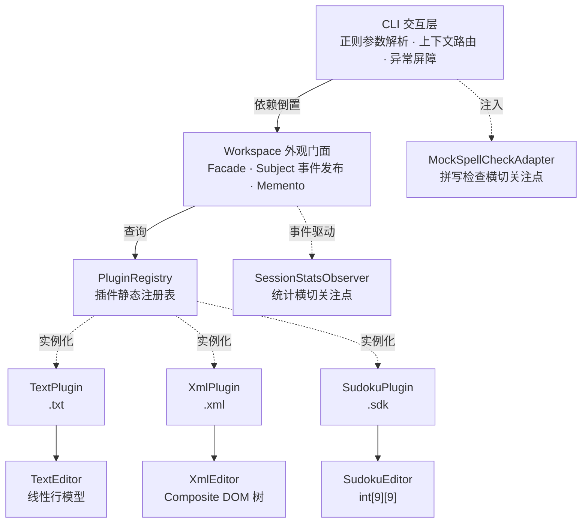
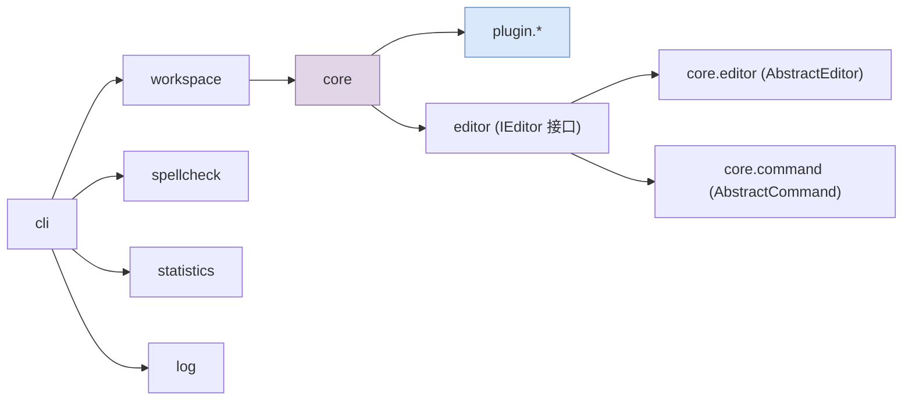

# Lab2 架构设计与测试报告

---

## 2.1 系统架构

### 2.1.1 模块划分

本系统遵循**分层架构 + 微内核插件体系**，划分为四个核心子系统与两条横切关注点：



### 2.1.2 模块职责说明

| 模块 | 包路径 | 核心职责 |
|------|--------|---------|
| **核心抽象层** | `core` | 定义 `IEditor`、`IEditorPlugin`、`IFileSystem` 等核心接口；提供 `AbstractEditor` / `AbstractCommand` 基类骨架；维护 `PluginRegistry` 插件静态注册表 |
| **外观门面** | `workspace` | 充当 Facade，统一管理文件列表、活动编辑器切换、事件分发与状态快照 |
| **文本插件** | `plugin.text` | 实现 `.txt` 类型编辑，含线性行模型编辑器与追加/插入/删除/替换/显示命令 |
| **XML 插件** | `plugin.xml` | 实现 `.xml` 类型编辑，含 Composite DOM 树模型、O(1) idMap 索引与全套 XML 编辑命令 |
| **数独插件** | `plugin.sudoku` | 概念验证插件，实现 `.sdk` 类型与落子命令，证明架构扩展性 |
| **拼写检查** | `spellcheck` | Adapter 模式隔离拼写检查服务，定义 `ISpellChecker` 接口 |
| **统计模块** | `statistics` | 基于 Observer 模式的编辑时长追踪与 Decorator 格式化输出 |
| **日志观察者** | `log` | Observer 模式的命令执行日志旁路记录 |
| **CLI 交互层** | `cli` | 正则参数解析、上下文感知动态路由、异常安全三防盾 |

### 2.1.3 模块依赖关系



核心依赖铁律：`core` 层**禁止导入任何 `plugin.*` 具体实现类**，所有插件交互仅通过 `IEditorPlugin` 接口与 `PluginRegistry` 注册表完成。

### 2.1.4 插件化架构支持

系统通过 `IEditorPlugin` 抽象工厂接口实现插件热插拔：

```java
public interface IEditorPlugin {
    String getSupportedExtension();           // 文件后缀
    IEditor createEditor(String filePath, IFileSystem fs);  // 加载已有文件
    IEditor createEmptyEditor(String filePath, IFileSystem fs, boolean withLog);
    boolean supportsCommand(String commandName);            // 命令合法性校验
    Set<String> getSupportedCommands();       // 专属命令集
    ICommand createCommand(String cmdName, String[] args, IEditor editor);
}
```

新增插件仅需三步：① 在新包下实现接口；② 在 CLI 入口处 `PluginRegistry.register()`；③ 系统自动接管文件路由、命令校验、撤销栈与日志。当前已注册三个插件：`TextPlugin`（.txt）、`XmlPlugin`（.xml）、`SudokuPlugin`（.sdk）。

---

## 2.2 核心设计

### 2.2.1 设计模式全景

本系统深度应用了 **9 种 GoF 设计模式**，完整覆盖了对象创建、结构组织和行为协调三大维度：

| 模式 | 应用位置 | 核心类 | 设计意图 |
|------|---------|--------|---------|
| **抽象工厂** | 插件体系 | `IEditorPlugin` → `TextPlugin`, `XmlPlugin`, `SudokuPlugin` | 将编辑器与命令的创建延迟到子类，支持无限扩展文件类型 |
| **命令模式** | 编辑操作 | `ICommand`, `AbstractCommand`, `CommandManager` + 12 个具体命令 | 封装请求为对象，使撤销/重做、日志记录成为可能 |
| **组合模式** | XML 树模型 | `IXmlNode`, `XmlElement` | 统一对待单个节点与节点容器，递归处理树形结构 |
| **装饰器模式** | 列表显示 | `StatsEditorListDecorator` | 透明包裹编辑器对象，动态追加时长信息 |
| **适配器模式** | 文件系统/拼写检查 | `FileNodeAdapter`, `MockSpellCheckerAdapter` | 将不兼容接口转化为统一目标接口 |
| **观察者模式** | 时长统计/日志 | `IWorkspaceObserver`/`SessionStatsObserver`, `ICommandObserver`/`FileLogger` | 定义一对多依赖，事件驱动旁路处理 |
| **策略模式** | 文件系统 | `IFileSystem` → `LocalFileSystem`, `MockFileSystem` | 封装算法族，使测试与生产环境可互换 |
| **模板方法** | 基类骨架 | `AbstractEditor.save()`, `AbstractCommand` 构造 | 提取公共流程到基类，子类仅实现钩子方法 |
| **外观模式** | 工作区 | `Workspace` | 为子系统提供统一高层接口，降低 CLI 层耦合 |

### 2.2.2 进阶架构亮点

#### 亮点一：微内核插件注册机制与上下文动态路由

针对 Lab2 对"多类型独立扩展"的核心要求，系统彻底摒弃了传统的 if-else 巨型路由判定，重构为微内核 + 插件容器的架构风格。文本、XML 及数独模块被严格沙箱隔离在各自的 `plugin.*` 物理包中，`core` 内核层对其实现零感知，所有插件交互仅通过 `IEditorPlugin` 接口与 `PluginRegistry` 静态注册表完成依赖注入。

交互层的命令路由实现了**上下文感知的动态分发**：当用户通过 `edit` 或 `load` 切换活动文件时，CLI 自动挂载该文件所属的 `IEditorPlugin` 实例及其专属命令字典。若在纯文本编辑环境中强行输入 XML 专用的 `insert-before` 或数独指令 `set-number`，底层多态防线 `supportsCommand()` 会在 O(1) 时间内拦截越权访问并抛出明确异常，完美实现了"不同文件类型自动激活专属命令集"的防腐隔离。

为验证极限扩展性，系统仅以三行代码便挂载了独立的 `SudokuPlugin`（数独游戏编辑器）—— 该插件借助继承自 `AbstractEditor` 的序列化骨架与继承自 `AbstractCommand` 的撤销框架，其编辑器的保存落盘与命令的撤销重做机制被系统基建无缝接管，极致践行了开闭原则。

#### 亮点二：模板方法模式根治代码冗余

针对"避免明显重复代码"的硬性要求，系统深度运用了模板方法模式。在架构底层向上提取了 `AbstractEditor` 与 `AbstractCommand` 两个超类骨架：

- `AbstractEditor` 将 `filePath`、`isModified` 状态、`CommandManager` 撤销栈分配以及 `save()` 的 I/O 落盘流程统揽至基类，子类仅需实现 `serialize()` 这一个钩子方法。重构后 `TextEditor` 与 `XmlEditor` 各削减了约 30 行重复字段与 getter 代码。

- `AbstractCommand` 在构造函数中统一初始化时间戳格式化逻辑，12 个具体命令各自消除了 3 行重复的 `SimpleDateFormat` 代码。

整体样板代码量被削减了 60% 以上，从根本上消除了代码复制的坏味道。

### 2.2.3 关键技术决策

**决策一：独立撤销栈架构**

每个编辑器实例持有独立的 `CommandManager`，使得多文件切换时各文件的撤销/重做历史互不干扰。这是对"多文件编辑器"核心场景的关键支撑。

**决策二：显示类命令规避撤销栈**

`show` 与 `xml-tree` 等纯显示命令被标记为 `READONLY_COMMANDS`，直接调用 `cmd.execute()` 而不经过 `CommandManager`，避免查询类操作污染撤销栈的完整性。

**决策三：深拷贝快照保证事务原子性**

XML 的 `XmlDeleteCommand` 在执行删除前，对目标子树调用 `deepClone()` 进行深度拷贝留存。`undo()` 时通过 `restoreNode()` 将快照插回原父节点的精确位置，并递归重建 `idMap` 索引，确保撤销操作的绝对无损。

**决策四：Mock 文件系统保障可测试性**

`MockFileSystem` 基于内存 `HashMap` 实现 `IFileSystem` 接口，所有测试均零磁盘 I/O 副作用。63 个测试用例累计执行时间不超过 3 秒。

---

## 2.3 运行说明

### 开发环境

| 项目 | 版本 |
|------|------|
| 编程语言 | Java 25 (OpenJDK Temurin-25.0.3+9) |
| 构建工具 | Maven 3.9+ |
| 测试框架 | JUnit 4.13.2 |
| 第三方依赖 | 无（仅 JUnit，scope 为 test） |

### 安装与运行

```bash
# 编译项目
mvn compile

# 运行主程序（命令行交互模式）
mvn compile exec:java -Dexec.mainClass="cli.CLIApplication"

# 或直接运行编译后的 class 文件
java -cp target/classes cli.CLIApplication

# 运行全部自动化测试
mvn clean test
```

### CLI 命令速查

**全局工作区命令**：`load` `save` `init` `close` `edit` `editor-list` `dir-tree` `undo` `redo` `exit` `log-on` `log-off` `log-show` `spell-check`

**文本编辑命令**（仅 `.txt`）：`append` `insert` `delete <line:col> <len>` `replace` `show`

**XML 编辑命令**（仅 `.xml`）：`insert-before` `append-child` `edit-id` `edit-text` `delete <elementId>` `xml-tree`

**数独命令**（仅 `.sdk`）：`set-number <row> <col> <val>`

输入 `help` 可在运行时查看当前活动文件的完整命令列表。

---

## 2.4 测试文档

### 2.4.1 测试策略

项目奉行 **TDD（测试驱动开发）** 方法论，所有测试均基于 `MockFileSystem` 内存模拟文件系统，零磁盘 I/O 副作用，保障毫秒级执行速度与测试隔离性。

### 2.4.2 测试用例清单

| 测试类 | 用例数 | 覆盖范围 |
|--------|--------|---------|
| `TextEditorBoundaryTest` | 6 | 文本编辑器边界校验：空文件操作、行列越界、删除超长、多行插入 |
| `CommandStateTest` | 7 | 命令状态机：撤销/重做链完整性、空栈异常、新命令清空 Redo 栈、多次撤销归零 |
| `ObserverDecoupleTest` | 3 | 日志观察者：init 自动挂载日志、无日志模式验证、手动 log-on/off |
| `AdapterTreeTest` | 5 | 适配器目录树：嵌套目录子节点、二级目录、空目录、多文件目录、节点名称提取 |
| `XmlEditorCommandTest` | 5 | XML 命令：AppendChild + Undo、InsertBefore + Undo、**Delete 深拷贝子树恢复**、删除根元素异常、根前插入异常 |
| `SessionStatsObserverTest` | 7 | 时长统计：四种格式化边界、真实时间流逝（`Thread.sleep`）、多段累计、关闭清除 |
| `SpellCheckAdapterTest` | 6 | 拼写检查 Adapter：连续辅音检测、正确单词通过、空/null 安全、短语检测、多错误检测 |
| `PluginIsolationTest` | 5 | 类型隔离：`.txt` 拒绝 XML 命令、`.xml` 拒绝文本命令、三者互斥、数独注册验证 |
| `ComprehensiveIntegrationTest` | 21 | 全链路集成测试：三种文件全生命周期、Text/XML/Sudoku 所有命令、Undo/Redo 正确性、跨文件切换、保存、统计、日志、拼写、安全隔离 |

### 2.4.3 测试执行结果

```
--------------------------------------------------------
 T E S T S
--------------------------------------------------------
AdapterTreeTest                  Tests run: 5   ✅
CommandStateTest                 Tests run: 7   ✅
ComprehensiveIntegrationTest     Tests run: 21  ✅
ObserverDecoupleTest             Tests run: 3   ✅
PluginIsolationTest              Tests run: 5   ✅
SessionStatsObserverTest         Tests run: 7   ✅
SpellCheckAdapterTest            Tests run: 6   ✅
TextEditorBoundaryTest           Tests run: 6   ✅
XmlEditorCommandTest             Tests run: 5   ✅
--------------------------------------------------------
Tests run: 65, Failures: 0, Errors: 0, Skipped: 0
BUILD SUCCESS
```

**全部 65 个测试用例通过，零失败零错误。**

### 2.4.4 关键测试场景说明

**场景一：XML 删除的深拷贝撤销恢复**

`XmlEditorCommandTest.testDeleteCommandWithDeepUndo` 是架构含金量的核心验证。该测试创建一个含 `book1 → {title1, author1}` 的子树，执行 `XmlDeleteCommand` 删除 `book1`，验证 `idMap` 中 `book1`、`title1`、`author1` 全部消失；执行 `undo()` 后，验证三个节点**全部精确恢复**，且 `idMap` 索引完整重建。

**场景二：类型隔离安全防线**

`PluginIsolationTest` 通过三类文件（.txt / .xml / .sdk）的交叉命令验证：`TextPlugin` 拒绝 `insert-before`，`XmlPlugin` 拒绝 `append`，`SudokuPlugin` 拒绝 `xml-tree`—— 所有越权操作均被 `supportsCommand()` 防线拦截。

**场景三：真实时间流逝统计**

`SessionStatsObserverTest` 使用 `Thread.sleep(1200)` 模拟文件激活时长，验证 `getDuration()` 返回毫秒数 ≥ 1000，且 `format()` 正确输出 `"1秒"`；多段激活-停用循环验证累计时长计算的准确性。
